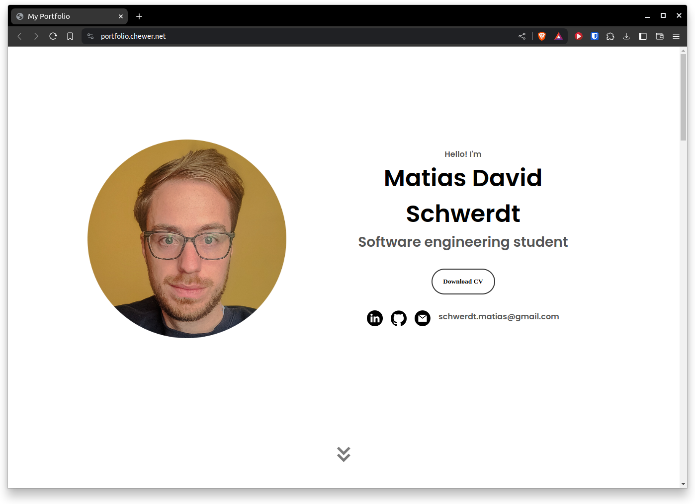

# Matias Schwerdt's Portfolio

Welcome to my portfolio repository! This portfolio is a web-based showcase of my projects, ranging from personal endeavors to university assignments. 

## Portfolio Website
You can access my portfolio website at https://portfolio.chewer.net. Feel free to explore the projects showcased there and reach out to me with any inquiries or collaboration opportunities.

## Repository Structure
- index.html: The main HTML file containing the structure and content of the portfolio website.
- style.css: Cascading Style Sheets defining the visual presentation of the website.
- mediaqueries.css: CSS file for responsive design, ensuring compatibility across various devices and screen sizes.
- script.js: JavaScript file handling interactive elements and dynamic behavior of the website.
- assets: Directory containing images and other media assets used in the portfolio.
- projects.csv: CSV file listing the projects featured in the portfolio, including details such as project name, description, and links.
- CNAME: Custom domain configuration file for hosting the portfolio on a custom domain.

## Screenshots

